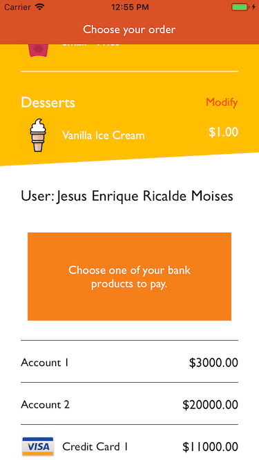
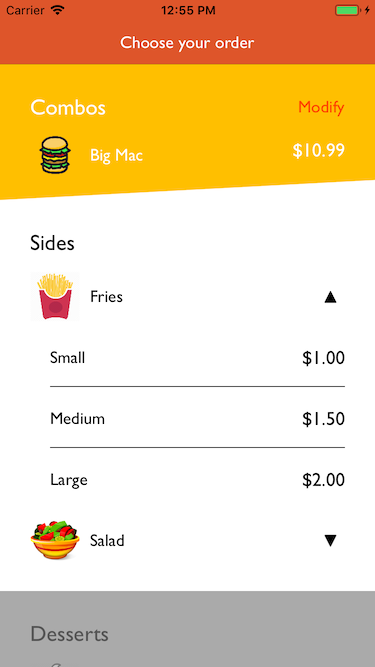
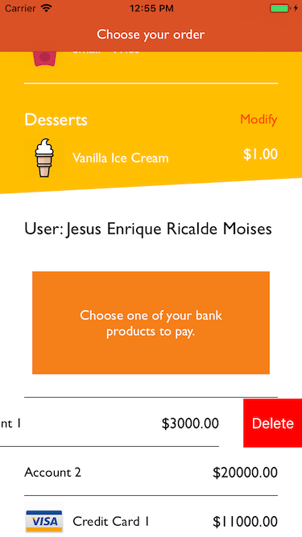

# WWCollapsibleForm

[](http://cocoapods.org/pods/WWCollapsibleForm)
[](http://cocoapods.org/pods/WWCollapsibleForm)
[](http://cocoapods.org/pods/WWCollapsibleForm)

Based on the idea of the collapsible panels from jquery ui, and created for the only purpose to build a wizard of steps, the collapsible form helps the user to go into a flow of steps until it finishes the wizard and get all the options selected.

## Example

To run the example project, clone the repo, and run `pod install` from the root directory first. The example project is also interesting since it's using VIPER and MVP to show how to set of architecture patterns in the same project.

## Instalation

WWCollapsibleForm is available through [CocoaPods](http://cocoapods.org). To install
it, simply add the following line to your Podfile:

```ruby
pod "WWCollapsibleForm"
```

## Screenshot


## Basic usage

The widget can be used inside storyboards/user interface by changing the class and module where a view is subclassing. Just go to the identity inspector of a selected view, go to the custom class and add `WWCollapsibleForm` for both class and module properties.

After that, the next step should be add section by creating an object from the `WWSection` class. 
The object will need a template for the header, the items and the selected header, when an item is selected.

All templates will be instances of `WWViewRepresentation`.

#### Example

```swift
let section : WWSection = WWSection(header: WWViewRepresentation(headerView: Header()),
                                            template: WWViewRepresentation(view: CellView()),
                                            selectedHeader: WWViewRepresentation(headerView: SelectedHeader()))
```

> Item views need to inherit from `WWItemView`, as headers views should inherit from `WWHeaderView`.
> Finally, selected headers inherit from `WWSelectedHeaderView`. 
> Note: _none of these classes inherit from UITableViewCell or UICollectionViewCell. They are plain UIViews_

After that, the section will expect data objects of type `WWDataObject` to show items. There are 3 types of data objects

> The objects need to be loaded during the view did load.

### WWTemplateDataObject

This object is simply going to take the template of the section and render it.

```swift
section.appendData(data: WWTemplateDataObject())
```

### WWNonTemplateDataObject

This object is going to take its own template from a view.

```swift
section.appendData(data: WWNonTemplateDataObject(view: AlternateCell()))
```



> The view needs to inherit from `WWItemView`.

### WWSubGroupDataObject

This object is going to create a sub group inside a section or another sub group and it will need a header and a template for the items. It works similar to a section but it doesn't have the same abilities as one, and the selected option will be related to the section.

```swift
let subGroup : WWSubGroupDataObject =  WWSubGroupDataObject(template: WWViewRepresentation(view: CellView()), headerTemplate : WWViewRepresentation(view: CellView()))
subGroup.appendData(object: WWTemplateDataObject())
subGroup.appendData(object: WWTemplateDataObject())
section.appendData(data: subGroup)
```



> The views need to inherit from `WWItemView`.

### Add options

If any of these objects have options to be shown when swipe from left to right or vice versa, `WWDataObject` objects have the function `appendOptions` and expects objects of type `WWOptionViewItem`.

```swift
dataObject.appendOptions(option: WWOptionViewItem(title: "Edit", backgroundColor: UIColor.blue, image: nil, padding: 10))
```

Options can set up their:

* Title
* Background color
* Image 
* Insets or padding
* Side where it will be
* Width
* Tint color
* If the icons will be center over text.

> Option Views are similar to Bar Buttons, where they are not views but objects that represent the views.

### Option for deleting an item.

The delete option is a special one, so the form doesn't allow to create one by itself but it gives a special way of creating one. 

```swift
data.appendOptions(option: data.createDeleteOption())
```



> It can modify every property as any other option, but it won't raise an event when the delete happen.

### Delegates

There are two important delegates, the form will use to send events to the container or delegate class.

* `WWCollapsibleFormCollapseDelegate`: It allows to inform when a collapse/expand is about to happen or it already happen.
* `WWCollapsibleFormDelegate`: It sends the header and the items to be modified by the real data, separating the UI from the model. It does not return the index of the item, but rather the data object related to it. The data object works as the index. The functions in this delegate are:
	* `Modify Header`: When a header needs to relate the model to the view. Gets the header view and the section index.
	* `Modify Item`: When an item needs to relate the model to the view. Gets the item view, the data object index and the section index.
	* `Item selected`: It occurs when an item is pressed. Gets the data object index and the section index.
	* `Option selecred`: When an option of an item gets pressed, this function will return the option pressed. Gets the data object index, the option object index and the section index.
	
### Footer

After all sections select an item, a footer can appear from the bottom to allow to show that the flow has ended. In order to add a footer, the form has to called it's function `setFooter`.

```swift
do {
	try self.form.setFooter(newFooter:UIView())
} catch {
        
}

```

> It throws an error if the view has a height of 0.


## Next steps

The widget still has to go to several changes. Here are the next steps that will occur:

1. Add objects after loading time and animated. These objects are:
	1. Sections
	2. Items
	3. Items inside groups
	4. Options
2. Scroll on to the next section after selecting the previous one.
3. Bug fix
	 1. The options close if the scroll hides the item and shows it again.
	 2. The footer shows but the final scroll is scrolling too far.
4. For the next version, the inner container, which is a UITableView, will be replaced with UIViews and UIStackViews. There's a playground called `WWCollapsibleFormV2` with this ide.

## Revision

* 0.1.0 First commit with initial features.
