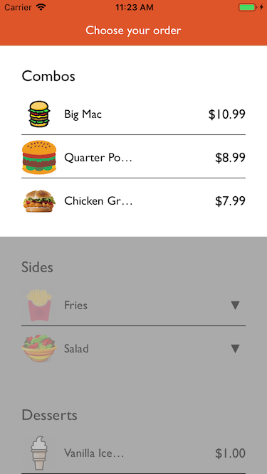

# WWCollapsibleForm

Based on the idea of the collapsible panels from jquery ui, and created for the only purpose to build a wizard of steps, the collapsible form helps the user to go into a flow of steps until it finishes the wizard and get all the options selected.

## Example

To run the example project, clone the repo, and run `pod install` from the root directory first. The example project is also interesting since it's using VIPER and MVP to show how to set of architecture patterns in the same project.

## Instalation

WWCollapsibleForm is available through [CocoaPods](http://cocoapods.org). To install
it, simply add the following line to your Podfile:

```ruby
pod "WWCollapsibleForm"
```

## Screenshot



## Basic usage

The widget can be used inside storyboards/user interface by changing the class and module where a view is subclassing. Just go to the identity inspector of a selected view, go to the custom class and add `WWCollapsibleForm` for both class and module properties.

After that, the next step should be add section by creating an object from the `WWSection` class. 
The object will need a template for the header, the items and the selected header, when an item is selected.

All templates will be instances of `WWViewRepresentation`.

#### Example

```swift
let section : WWSection = WWSection(header: WWViewRepresentation(headerView: Header()),
                                            template: WWViewRepresentation(view: CellView()),
                                            selectedHeader: WWViewRepresentation(headerView: SelectedHeader()))
```

> Item views need to inherit from `WWItemView`, as headers views should inherit from `WWHeaderView`.
> Finally, selected headers inherit from `WWSelectedHeaderView`. 
> Note: _none of these classes inherit from UITableViewCell or UICollectionViewCell. They are plain UIViews_

After that, the section will expect data objects of type `WWDataObject` to show items. There are 3 types of data objects

> The objects need to be loaded during the view did load.

### WWTemplateDataObject

This object is simply going to take the template of the section and render it.

```swift
section.appendData(data: WWTemplateDataObject())
```

### WWNonTemplateDataObject

This object is going to take its own template from a view.

```swift
section.appendData(data: WWNonTemplateDataObject(view: AlternateCell()))
```

> The view needs to inherit from `WWItemView`.

### WWSubGroupDataObject

This object is going to create a sub group inside a section or another sub group and it will need a header and a template for the items. It works similar to a section but it doesn't have the same abilities as one, and the selected option will be related to the section.

```swift
let subGroup : WWSubGroupDataObject =  WWSubGroupDataObject(template: WWViewRepresentation(view: CellView()), headerTemplate : WWViewRepresentation(view: CellView()))
subGroup.appendData(object: WWTemplateDataObject())
subGroup.appendData(object: WWTemplateDataObject())
section.appendData(data: subGroup)
```

> The views need to inherit from `WWItemView`.

### Add options

If any of these objects have options to be shown when swipe from left to right or vice versa, `WWDataObject` objects have the function `appendOptions` and expects objects of type `WWOptionViewItem`.

```swift
dataObject.appendOptions(option: WWOptionViewItem(title: "Edit", backgroundColor: UIColor.blue, image: nil, padding: 10))
```

Options can set up their:

* Title
* Background color
* Image 
* Insets or padding
* Side where it will be
* Width
* Tint color
* If the icons will be center over text.

> Option Views are similar to Bar Buttons, where they are not views but objects that represent the views.

### Option for deleting an item.

The delete option is a special one, so the form doesn't allow to create one by itself but it gives a special way of creating one. 

```swift
data.appendOptions(option: data.createDeleteOption())
```

> It can modify every property as any other option, but it won't raise an event when the delete happen.

### Delegates